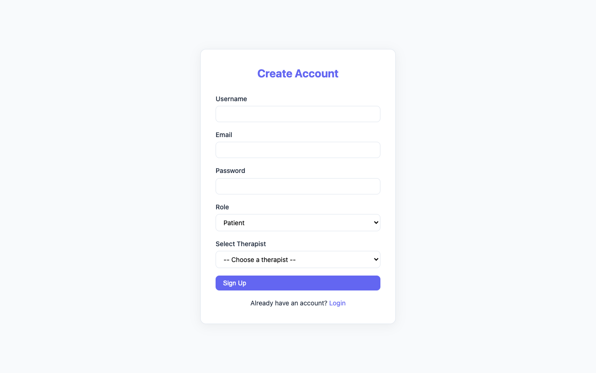
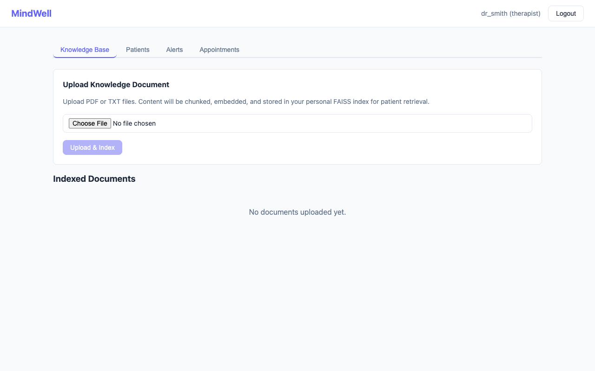
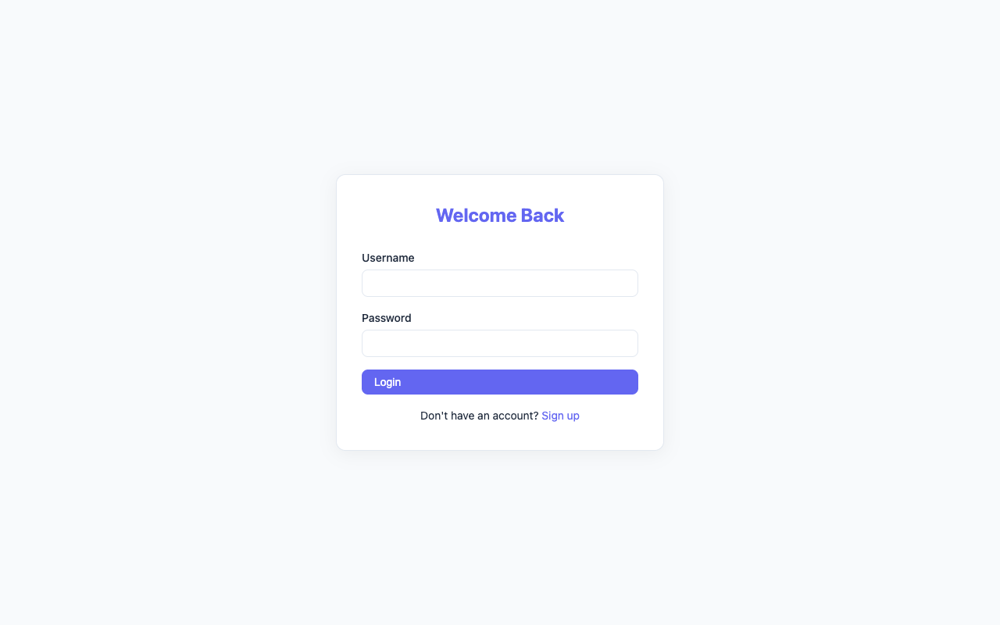
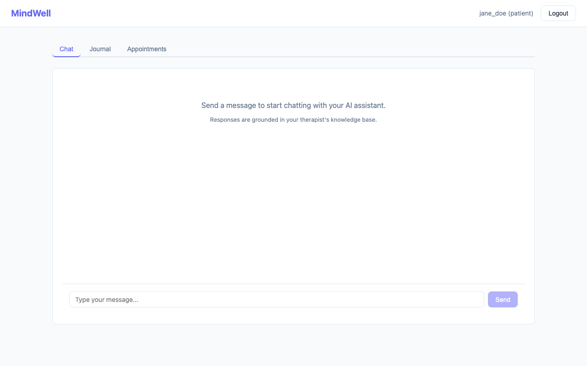
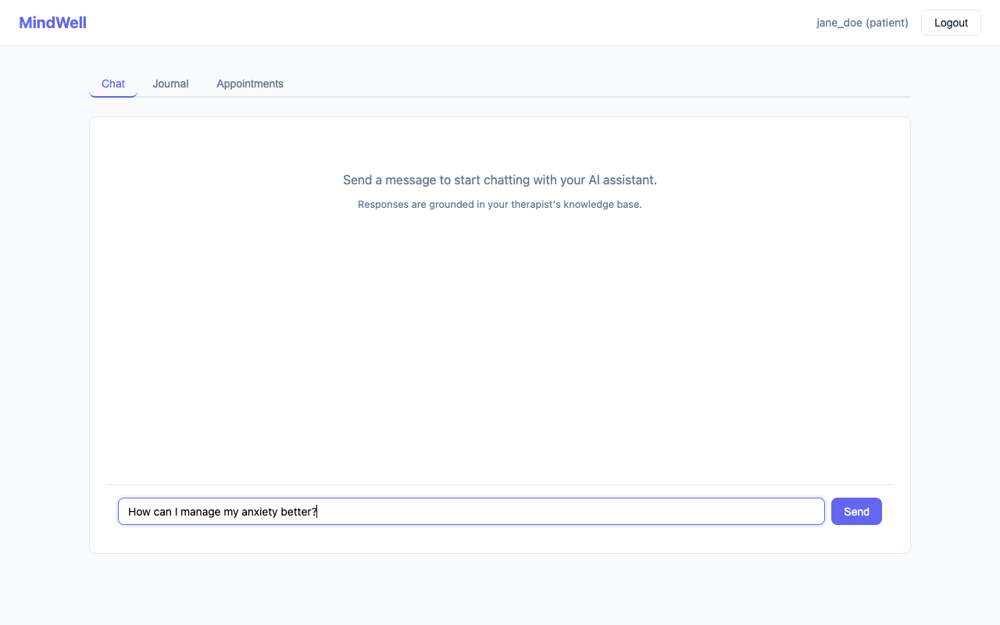
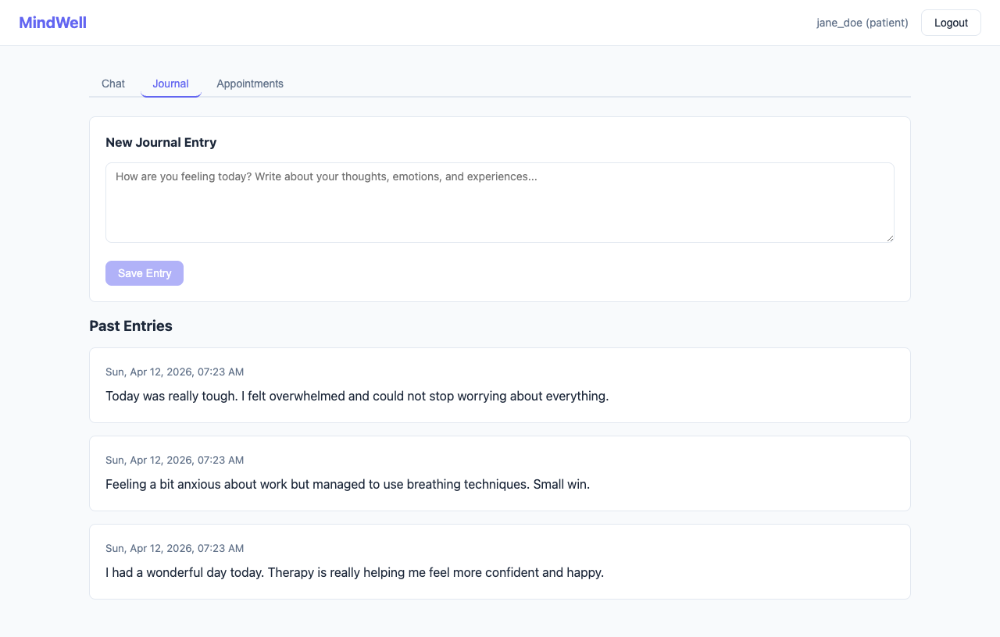
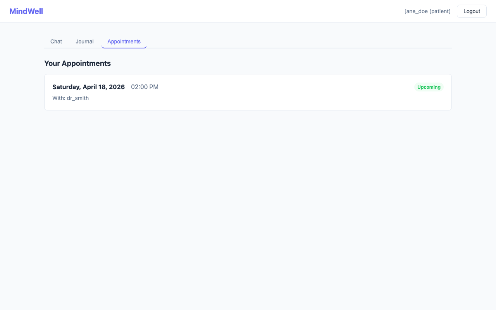

# MindWell - AI-Powered Mental Health Assistant

## Download additional files directly from here "https://drive.google.com/drive/folders/1ccnvixCfgB1WzwiM2CH-U9ul2tiVuteE?usp=sharing" and paste it as is in the directory

A full-stack mental health support platform that pairs patients with therapists and provides AI-assisted guidance grounded in therapist-curated knowledge. Built with a Retrieval-Augmented Generation (RAG) pipeline, automated sentiment tracking, and a clinical alert system -- all running locally for complete data privacy.

---

## Why MindWell?

Mental health support has two major gaps: **accessibility** and **continuity of care**. Patients often can't reach their therapist between sessions, and therapists lack real-time visibility into how patients are doing day-to-day.

MindWell bridges both:

- **For patients**: An AI chat assistant available 24/7 that answers questions using *only* the materials their therapist has provided -- no hallucinated medical advice, no generic chatbot responses. A private journal with guided prompts helps patients track their emotional state between sessions.

- **For therapists**: A dashboard that surfaces patients who may be struggling (via automated sentiment analysis of journal entries), manages appointments, and maintains a curated knowledge base that directly powers the AI assistant their patients interact with.

- **For privacy**: Everything runs locally. The LLM (Mistral 7B via Ollama), embeddings, FAISS indexes, and the database all stay on the machine. No patient data leaves the system.

---

## Screenshots

### Authentication

| Login | Sign Up | Sign Up (Patient with therapist selection) |
|:-----:|:-------:|:------------------------------------------:|
|  |  |  |

Patients must select their assigned therapist during registration. This links them to that therapist's knowledge base and dashboard.

---

### Therapist Dashboard

#### Knowledge Base Management
Upload PDF or TXT files containing therapy resources, CBT worksheets, coping strategies, or any clinical material. Files are automatically chunked, embedded, and stored in a per-therapist FAISS vector index.



#### Patient Monitoring & Progress
View all assigned patients with expandable sentiment progress panels. Each journal entry is scored and visualized with color-coded tiles (green = positive, red = negative, yellow = neutral). The 7-day rolling average gives a quick snapshot of trajectory.



#### Alert System
Patients whose 7-day rolling sentiment average falls below the configured threshold (-0.2) are automatically flagged. This catches downward trends early, even between scheduled sessions.


#### Appointment Scheduling
Create appointments for any assigned patient with date, time, and private session notes (only visible to the therapist).


---

### Patient Dashboard

#### AI Chat (RAG-Powered)
Patients chat with an AI assistant whose responses are grounded in their therapist's uploaded knowledge base. Streaming responses appear in real-time. Sources (retrieved chunks) are viewable for transparency.

| Empty Chat | Composing a Message |
|:----------:|:-------------------:|
|  |  |

#### Journal
Patients write daily reflections. Each entry is automatically scored for sentiment (VADER analysis) and stored. Patients see their entries but *not* their scores -- only the therapist sees sentiment data to avoid self-monitoring anxiety.



#### Appointments
Patients view their upcoming and past appointments. Session notes from the therapist are not exposed to the patient.



---

## Architecture

```
                    +-------------------+
                    |   React Frontend  |  :3000
                    |  (Role-based UI)  |
                    +---------+---------+
                              |
                         Axios + JWT
                              |
                    +---------+---------+
                    |   Flask Backend   |  :5001
                    |    (REST API)     |
                    +---------+---------+
                              |
            +---------+-------+-------+---------+
            |         |               |         |
        +---+---+ +---+---+     +----+----+ +---+---+
        | SQLite| | FAISS |     |  Ollama | | VADER |
        |  (DB) | |(Vector|     | (LLM)  | |(Sent.)|
        +-------+ | Store)|     +---------+ +-------+
                   +-------+       :11434
```

### RAG Pipeline (Chat Flow)

```
Patient sends message
        |
        v
  Embed query (sentence-transformers, all-MiniLM-L6-v2)
        |
        v
  Search therapist's FAISS index (top-5 cosine similarity)
        |
        v
  Build prompt: system instructions + retrieved context + patient query
        |
        v
  Send to Ollama (Mistral 7B) via HTTP API
        |
        v
  Stream response back to patient (Server-Sent Events)
```

### Sentiment Scoring System

Each journal entry is scored using **VADER** (Valence Aware Dictionary and sEntiment Reasoner):

| Score Range | Classification | Example |
|:-----------:|:--------------:|:--------|
| +0.5 to +1.0 | Strong Positive | *"I had an amazing day, feeling grateful"* |
| +0.05 to +0.5 | Mild Positive | *"Things went okay, had a decent lunch"* |
| -0.05 to +0.05 | Neutral | *"I woke up and went to work"* |
| -0.5 to -0.05 | Mild Negative | *"Felt tired and anxious today"* |
| -1.0 to -0.5 | Strong Negative | *"Everything is terrible, I can't cope"* |

**Alert threshold**: If a patient's **7-day rolling average** drops below **-0.2**, they are flagged as "needs attention" on the therapist's dashboard.

---

## Tech Stack

| Layer | Technology | Purpose |
|-------|-----------|---------|
| Frontend | React 18, React Router, Axios | SPA with role-based routing |
| Backend | Flask, Flask-SQLAlchemy, Flask-CORS | REST API, ORM, CORS |
| Database | SQLite | Users, journals, appointments, documents |
| Vector Store | FAISS (faiss-cpu) | Per-therapist similarity search |
| Embeddings | sentence-transformers (all-MiniLM-L6-v2) | Text-to-vector encoding |
| LLM | Mistral 7B via Ollama | Local inference, streaming |
| Sentiment | VADER (vaderSentiment) | Journal entry scoring |
| Auth | JWT (PyJWT) + bcrypt | Token-based, role-gated |
| PDF Parsing | PyMuPDF / pdfplumber | Knowledge extraction |

---

## Project Structure

```
mindwell/
  main.py                    # Single-command launcher (starts everything)
  README.md

  backend/
    app.py                   # Flask app factory
    config.py                # All configuration constants
    requirements.txt
    models/
      user.py                # User model (patient/therapist roles)
      journal.py             # Journal entries with sentiment scores
      appointment.py         # Therapist-patient appointments
      knowledge.py           # Uploaded document metadata
    routes/
      auth.py                # POST /signup, /login, GET /therapists
      patient.py             # POST /chat, /journal, GET /appointments
      therapist.py           # POST /upload, /appointment, GET /alerts, /patients
    services/
      embedding_service.py   # Embeddings, chunking, FAISS index CRUD
      ollama_service.py      # Ollama HTTP client (sync + streaming)
      rag_service.py         # Full RAG pipeline (retrieve -> prompt -> generate)
      journal_service.py     # Sentiment analysis + rolling averages
      alert_service.py       # Threshold-based patient alerting
    utils/
      auth.py                # JWT encode/decode, bcrypt, decorators
    faiss_indexes/           # Per-therapist vector indexes (auto-created)

  frontend/
    package.json
    public/index.html
    src/
      App.js                 # Router + Navbar + ProtectedRoute
      index.js               # Entry point
      index.css              # Complete stylesheet
      pages/
        Login.js             # Login form
        Signup.js            # Signup with role + therapist selection
        PatientDashboard.js  # Tabbed: Chat, Journal, Appointments
        TherapistDashboard.js # Tabbed: Knowledge, Patients, Alerts, Appointments
      components/
        ChatBox.js           # Streaming chat with source viewer
        JournalForm.js       # Journal entry + history
        AppointmentList.js   # Patient appointment view
        FileUpload.js        # PDF/TXT upload with doc list
        PatientList.js       # Patient list with progress panels
        AlertList.js         # Flagged patients
        AppointmentForm.js   # Create appointment form
      services/
        api.js               # Axios client + SSE streaming helper
```

---

## Setup Instructions

### Prerequisites

- Python 3.10+
- Node.js 18+
- Ollama ([ollama.com](https://ollama.com))

### Quick Start (Single Command)

```bash
# 1. Install Ollama and pull the model (one-time)
brew install ollama
ollama pull mistral

# 2. Install backend dependencies
cd backend
pip install -r requirements.txt
cd ..

# 3. Install frontend dependencies
cd frontend
npm install
cd ..

# 4. Launch everything
python main.py
```

`main.py` will:
- Verify Ollama is running (starts it if needed)
- Start the Flask backend on port 5001
- Start the React dev server on port 3000
- Print status when everything is ready

Press **Ctrl+C** to stop all services.

### Manual Start (3 Terminals)

```bash
# Terminal 1: Ollama
ollama serve

# Terminal 2: Backend
cd backend && python app.py

# Terminal 3: Frontend
cd frontend && npm start
```

---

## API Reference

### Authentication
| Method | Endpoint | Body | Description |
|--------|----------|------|-------------|
| POST | `/signup` | `{username, email, password, role, therapist_id?}` | Register |
| POST | `/login` | `{username, password}` | Login, returns JWT |
| GET | `/therapists` | -- | List therapists (public) |

### Patient Endpoints (JWT required, role=patient)
| Method | Endpoint | Body | Description |
|--------|----------|------|-------------|
| POST | `/chat` | `{message, stream?}` | RAG chat (SSE if stream=true) |
| POST | `/journal` | `{content}` | Submit journal entry |
| GET | `/journal` | -- | List own journal entries |
| GET | `/appointments` | -- | View own appointments |

### Therapist Endpoints (JWT required, role=therapist)
| Method | Endpoint | Body | Description |
|--------|----------|------|-------------|
| POST | `/upload` | `multipart/form-data (file)` | Upload knowledge PDF/TXT |
| GET | `/documents` | -- | List uploaded documents |
| GET | `/alerts` | -- | Patients needing attention |
| GET | `/patients` | -- | List assigned patients |
| GET | `/patient/:id/progress` | -- | Patient sentiment data |
| POST | `/appointment` | `{patient_id, date, notes?}` | Create appointment |

---

## Database Schema

```sql
-- Users (both patients and therapists)
CREATE TABLE users (
    id              INTEGER PRIMARY KEY,
    username        VARCHAR(80) UNIQUE NOT NULL,
    email           VARCHAR(120) UNIQUE NOT NULL,
    password_hash   VARCHAR(128) NOT NULL,
    role            VARCHAR(20) NOT NULL,        -- 'patient' or 'therapist'
    therapist_id    INTEGER REFERENCES users(id), -- NULL for therapists
    created_at      DATETIME DEFAULT NOW
);

-- Journal entries with automatic sentiment scoring
CREATE TABLE journal_entries (
    id              INTEGER PRIMARY KEY,
    patient_id      INTEGER NOT NULL REFERENCES users(id),
    content         TEXT NOT NULL,
    sentiment_score FLOAT,                       -- VADER compound: -1.0 to +1.0
    created_at      DATETIME DEFAULT NOW
);

-- Therapist-patient appointments
CREATE TABLE appointments (
    id              INTEGER PRIMARY KEY,
    therapist_id    INTEGER NOT NULL REFERENCES users(id),
    patient_id      INTEGER NOT NULL REFERENCES users(id),
    date            DATETIME NOT NULL,
    notes           TEXT,                        -- Therapist-only, hidden from patient
    created_at      DATETIME DEFAULT NOW
);

-- Metadata for uploaded knowledge documents
CREATE TABLE knowledge_documents (
    id              INTEGER PRIMARY KEY,
    therapist_id    INTEGER NOT NULL REFERENCES users(id),
    filename        VARCHAR(255) NOT NULL,
    chunk_count     INTEGER DEFAULT 0,
    created_at      DATETIME DEFAULT NOW
);
```

---

## Configuration

All settings in `backend/config.py`:

| Variable | Default | Description |
|----------|---------|-------------|
| `OLLAMA_BASE_URL` | `http://localhost:11434` | Ollama server address |
| `OLLAMA_MODEL` | `mistral` | LLM model name |
| `EMBEDDING_MODEL` | `all-MiniLM-L6-v2` | Sentence transformer for embeddings |
| `RAG_TOP_K` | `5` | Chunks retrieved per query |
| `RAG_CHUNK_SIZE` | `500` | Characters per text chunk |
| `RAG_CHUNK_OVERLAP` | `50` | Overlap between chunks |
| `ALERT_THRESHOLD` | `-0.2` | Sentiment score triggering alerts |
| `JWT_ACCESS_TOKEN_EXPIRES` | `86400` | Token TTL in seconds (24h) |
| `MAX_CONTENT_LENGTH` | `16 MB` | Max upload file size |

All values can be overridden via environment variables.

---

## Usage Workflow

### First-Time Setup

1. **Therapist signs up** with role "therapist"
2. **Therapist uploads knowledge** -- PDFs, therapy worksheets, coping strategy guides, CBT materials
3. **Patient signs up** with role "patient" and selects their therapist

### Daily Use

4. **Patient chats** with the AI assistant -- responses are grounded in the therapist's uploaded materials
5. **Patient journals** daily -- entries are sentiment-scored automatically
6. **Therapist checks dashboard** -- reviews alerts for patients trending negative, views sentiment progress charts, schedules appointments

### Key Design Decisions

- **Patients cannot see their own sentiment scores** -- this prevents self-monitoring anxiety and score-chasing behavior. Only therapists see progress data.
- **Each therapist has an isolated FAISS index** -- Patient A's therapist's materials are never accessible to Patient B's therapist.
- **Appointment notes are therapist-only** -- patients see date/time but not the therapist's session notes.
- **Chat responses always cite sources** -- patients can verify which knowledge chunk informed the AI's answer.

---

## How MindWell Helps

### For Patients
- **24/7 guided support** between therapy sessions, grounded in trusted materials rather than generic internet advice
- **Structured journaling** with a low-friction interface encourages daily emotional check-ins
- **Crisis detection** -- if a patient mentions self-harm or crisis language, the AI immediately recommends contacting their therapist or a crisis helpline
- **Transparency** -- every AI response shows the source material it drew from

### For Therapists
- **Early warning system** -- automated alerts surface struggling patients days before a scheduled session
- **Longitudinal insight** -- sentiment trends over weeks/months reveal patterns invisible in hourly sessions
- **Knowledge curation** -- upload exactly the materials you want your patients to reference, ensuring the AI stays within your clinical framework
- **Time savings** -- common informational questions (coping techniques, breathing exercises, CBT worksheets) are handled by the AI, freeing session time for deeper work

### For Clinics
- **Complete data sovereignty** -- no PHI leaves the machine (local LLM, local DB, local vectors)
- **Scalable** -- one therapist can effectively monitor dozens of patients between sessions
- **Auditable** -- every chat interaction is traceable to specific source documents

---

## What Would Make It Better

### High-Impact Improvements

1. **Conversation memory** -- Currently each chat message is stateless. Adding conversation history (last N turns) to the prompt would make multi-turn dialogues feel natural rather than each message being treated independently.

2. **Better embedding model** -- `all-MiniLM-L6-v2` is fast but shallow (384 dimensions). Upgrading to `all-mpnet-base-v2` (768d) or a domain-specific clinical embedding model would significantly improve retrieval quality for medical/therapeutic content.

3. **Hybrid search (BM25 + vector)** -- Pure semantic search misses exact keyword matches. Combining FAISS with BM25 (e.g., via rank fusion) would handle both "what is CBT" (keyword) and "I feel lost and don't know what to do" (semantic) queries well.

4. **Structured assessments** -- Integrate validated clinical instruments (PHQ-9 for depression, GAD-7 for anxiety) as periodic in-app questionnaires. These produce clinically meaningful scores that VADER sentiment cannot match.

5. **End-to-end encryption** -- While data stays local, adding at-rest encryption for the SQLite database and FAISS indexes would meet HIPAA technical safeguard requirements.

### Medium-Impact Improvements

6. **Chat history persistence** -- Store conversations in the database so patients can revisit past sessions and therapists can review what their patients asked.

7. **Better chunking strategy** -- Switch from fixed character-count chunks to semantic chunking (split on paragraph/section boundaries) for more coherent retrieval.

8. **Multi-modal knowledge** -- Support image-based therapy materials (worksheets, diagrams) via OCR or vision models.

9. **Therapist-to-patient messaging** -- Direct secure messaging channel, not just AI chat.

10. **Mobile-responsive UI / PWA** -- The current CSS works on mobile viewports but a dedicated mobile experience (or Progressive Web App) would improve patient engagement.

### Research-Grade Extensions

11. **Fine-tuned clinical model** -- Replace Mistral with a model fine-tuned on therapy transcripts (with proper IRB approval and de-identification) for significantly better empathetic responses.

12. **Crisis detection model** -- Replace keyword-based crisis detection with a trained classifier that catches implicit risk signals ("I don't see the point anymore").

13. **Therapist co-pilot** -- An additional AI view for therapists that summarizes patient journals, suggests session topics, and highlights concerning patterns across the patient population.

14. **FHIR integration** -- Connect to electronic health record systems via HL7 FHIR for clinical workflow integration.

---

## License

This project is for educational and research purposes. Not approved for clinical use without proper regulatory review.
